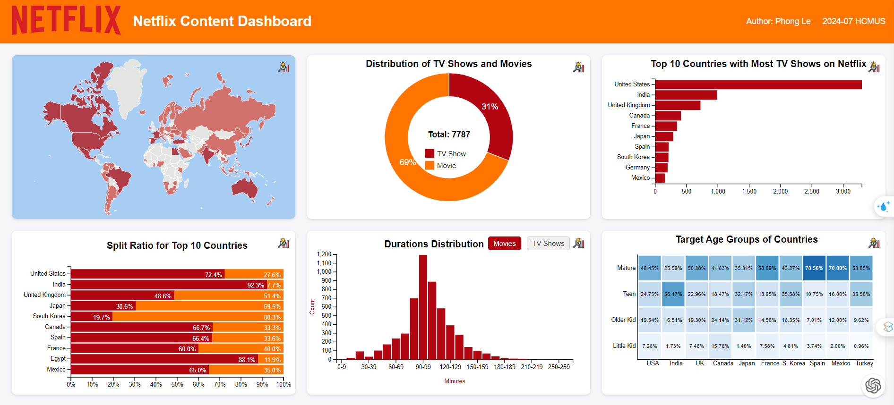

# Netflix Content Dashboard

Welcome to the **Netflix Content Dashboard**! 🎬📊 This simple dashboard visualizes a comprehensive dataset of Netflix content, offering insights into the global distribution of movies and TV shows.

## 🛠️ Overview

This project showcases a beautifully designed dashboard that utilizes various chart idioms to present Netflix content data. The dashboard help us explore and analyze data through multiple charts, maps, and heat-maps.



### Key Features

- **Interactive Charts**
- **Dynamic Heatmaps**
- **Detailed Insights**
- **Responsive Design**

## 🌟 Highlights

### 1. **Charts and Visualizations**

- **Content Distribution Map**: Explore the global distribution of Netflix content by country.
- **Bar Charts**: Compare the number of TV shows and movies by country and duration.
- **Heatmaps**: Visualize genre distribution and age group preferences across different countries.
- **Stacked Bar Charts**: Analyze the ratio of TV shows to movies and trends over time.

### 3. **Interactive Tooltips**

Hover over the insight icons to reveal tooltips with dynamic, detailed information about each chart. The tooltips:
- **Appear on Hover**: Smooth transitions and engaging animations.
- **Provide Insights**: Display a list of key insights and observations related to the chart.

## 🚀 Getting Started

### Prerequisites

Web browsers like Chrome, Firefox, or Safari.


### Installation

1. **Clone the Repository**
   ```bash
   git clone https://github.com/yourusername/netflix-content-dashboard.git
   cd netflix-content-dashboard
   ```

2. **Open the Project**
   - Open `index.html` in your preferred web browser to view the dashboard.


## 📝 File Structure

- `index.html`: Main HTML file that includes the layout and references to scripts and styles.
- `styles`: Contains all the CSS styles for the dashboard.
- `scripts/insights.js`: Handles tooltip interactions and dynamic content loading.
- `charts`: all charts in this dashboard.

---

Enjoy exploring Netflix content through data visualization! 🚀📈

---

This file is rendered by ChatGPT :)